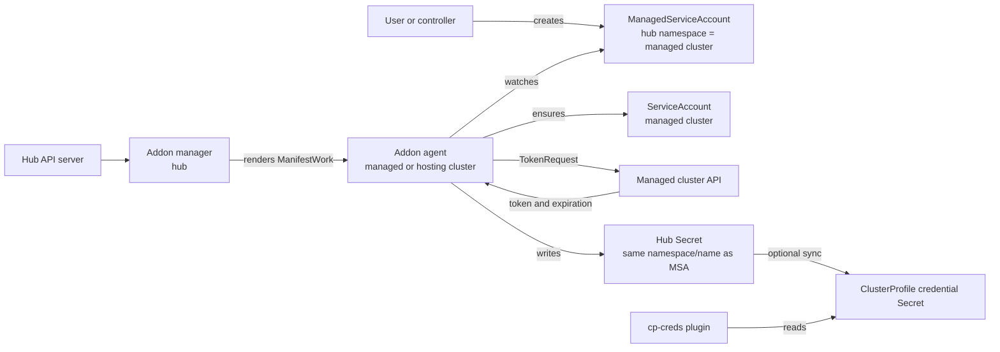
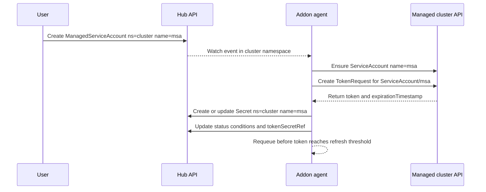
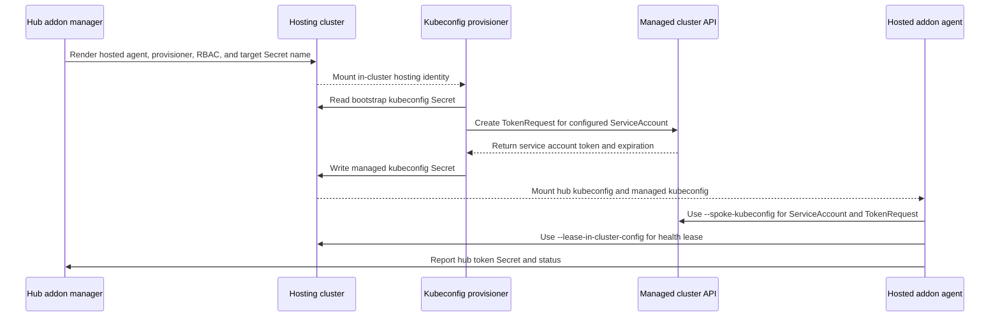
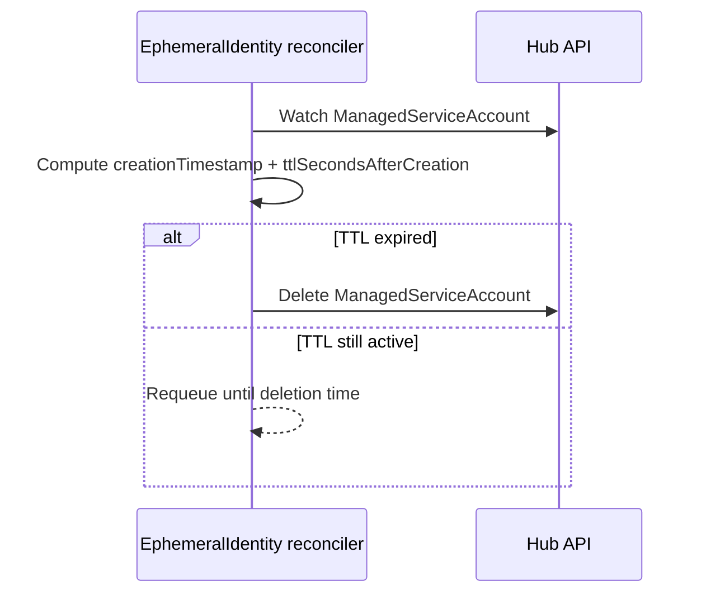
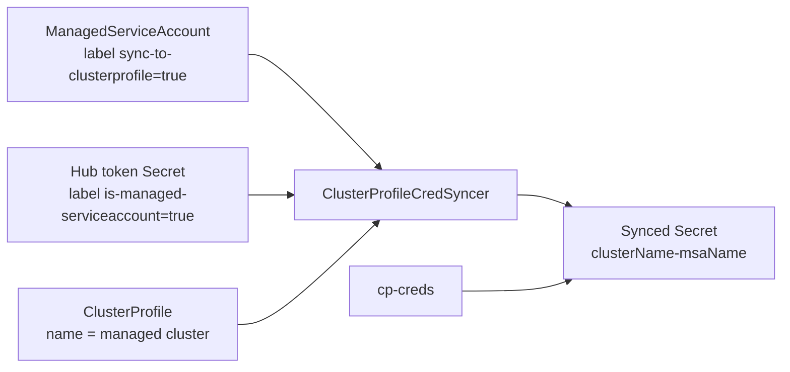

# Managed ServiceAccount Architecture

Managed ServiceAccount is an Open Cluster Management (OCM) addon that turns a
hub-side `ManagedServiceAccount` custom resource into a Kubernetes
`ServiceAccount` on a managed cluster, mints a projected service account token
with the managed cluster API, and reports that credential back to the hub as a
`Secret`.

The hub remains the control plane for desired identity objects and collected
credentials. The addon agent is the only component that talks to the managed
cluster API in the default mode. Hosted mode keeps the same API contract but
runs the agent on a hosting cluster and gives it a generated kubeconfig for the
managed cluster.

## Component Model



| Component | Runtime location | Primary responsibility |
| --- | --- | --- |
| `ManagedServiceAccount` API | Hub cluster | Desired identity for one managed cluster namespace. |
| Addon manager | Hub cluster | Registers the addon, renders agent manifests, grants hub RBAC, and renders hosted-mode workloads. |
| Addon agent | Managed cluster by default; hosting cluster in hosted mode | Watches hub `ManagedServiceAccount` objects for one cluster, creates managed-cluster `ServiceAccount` objects, requests tokens, and writes hub token secrets/status. |
| Managed cluster API | Managed cluster | Serves `ServiceAccount` and `serviceaccounts/token` requests. |
| Hub token `Secret` | Hub cluster, managed cluster namespace | Stores `token` and `ca.crt` data for the projected managed-cluster service account token. |
| Hosted kubeconfig provisioner | Hosting cluster, hosted mode only | Reads a bootstrap kubeconfig, mints a token for the managed service account, and writes the kubeconfig mounted by the hosted agent. |
| `ClusterProfileCredSyncer` | Hub cluster, `ClusterProfile` feature only | Copies selected hub token secrets into matching `ClusterProfile` namespaces. |
| `cp-creds` plugin | Consumer runtime | Implements ClusterProfile exec authentication by reading a synced token secret. |

## Key Artifacts

| Artifact | Location | Owner or writer | Notes |
| --- | --- | --- | --- |
| `ManagedClusterAddOn/managed-serviceaccount` | Hub namespace named for the managed cluster | User, addon installer, or addon framework | Selects the cluster and install namespace for the addon agent. |
| `ManagedServiceAccount/<name>` | Hub namespace named for the managed cluster | User or automation | Desired identity; `spec.rotation.validity` requests token lifetime. |
| `ServiceAccount/<name>` | Agent install namespace on the managed cluster | Addon agent | Created with `authentication.open-cluster-management.io/is-managed-serviceaccount=true`. |
| Hub token `Secret/<name>` | Same hub namespace/name as the `ManagedServiceAccount` | Addon agent | Opaque secret with `token` and `ca.crt`; owner reference points to the `ManagedServiceAccount`. |
| Hosted bootstrap kubeconfig `Secret` | Hosting cluster, default namespace = managed cluster name | Hosted-mode operator | Default name `external-managed-kubeconfig`; contains a `kubeconfig` key. |
| Hosted managed kubeconfig `Secret` | Hosting cluster addon install namespace | Hosted kubeconfig provisioner | Default name `<addon-name>-managed-kubeconfig`; mounted at `/etc/managed/kubeconfig`. |
| Synced ClusterProfile credential `Secret` | `ClusterProfile` namespace | `ClusterProfileCredSyncer` | Name is `<clusterName>-<managedServiceAccountName>` and owner reference points to the `ClusterProfile`. |

## Feature Gates

| Feature gate | Default | Enables |
| --- | --- | --- |
| `EphemeralIdentity` | `false` | `spec.ttlSecondsAfterCreation`; a reconciler deletes expired `ManagedServiceAccount` objects. |
| `ClusterProfile` | `false` | Hub-side credential sync from labeled `ManagedServiceAccount` token secrets into matching `ClusterProfile` namespaces. |

Feature gates are configured on the manager and agent with
`--feature-gates=EphemeralIdentity=<bool>,ClusterProfile=<bool>`. The Helm chart
maps these to `featureGates.ephemeralIdentity` and
`featureGates.clusterProfile`.

## Default Reconciliation

In the default deployment, the addon manager runs on the hub and the addon agent
runs on the managed cluster. The agent's hub cache is scoped to the hub
namespace named after `--cluster-name`. Its spoke client uses in-cluster config,
so the service account and token request happen inside the agent install
namespace on the managed cluster.



The hub secret is refreshed when it is missing, has the wrong service account
subject, fails token review, or reaches the rotation threshold. The threshold is
calculated from the actual token lifetime returned by the managed cluster:
refresh after 80 percent of the interval between the last refresh time and the
expiration timestamp has elapsed.

```yaml
apiVersion: authentication.open-cluster-management.io/v1beta1
kind: ManagedServiceAccount
metadata:
  name: admin
  namespace: cluster1
spec:
  rotation:
    validity: 8640h0m0s
```

```text
ManagedServiceAccount cluster1/admin
  -> managed cluster ServiceAccount <addon-install-namespace>/admin
  -> hub Secret cluster1/admin
  -> status.tokenSecretRef.name: admin
```

## Hosted Mode

Hosted mode keeps `ManagedServiceAccount` objects and reported token secrets on
the hub, but the agent pod runs on a hosting cluster instead of the managed
cluster. The addon manager renders both the hosted agent and a kubeconfig
provisioner. The provisioner converts a bootstrap kubeconfig into a rotating,
portable kubeconfig that authenticates as the managed service account.



Hosted mode is rendered only by the addon manager, so it requires
`hubDeployMode: Deployment`. `hubDeployMode: AddOnTemplate` does not run the
addon manager and does not render hosted-mode workloads.

The hosted provisioner defaults are:

| Variable | Default |
| --- | --- |
| `ExternalManagedKubeConfigNamespace` | Managed cluster name |
| `ExternalManagedKubeConfigSecret` | `external-managed-kubeconfig` |
| `ManagedKubeConfigSecret` | `<addon-name>-managed-kubeconfig` |
| `ManagedServiceAccountName` | `managed-serviceaccount` |
| `ManagedKubeConfigTokenExpirationSeconds` | `3600` |
| `ManagedKubeConfigRefreshBeforeSeconds` | `600` |
| `ManagedKubeConfigProvisionerSyncInterval` | `5m` |

The bootstrap kubeconfig must be portable inside the provisioner pod: embed CA
data and user credentials inline, do not rely on local files, and do not use
`exec` credentials. Its cluster entry is copied into the generated kubeconfig
mounted by the hosted agent. The provisioner validates portability before it
short-circuits on a fresh target secret.

## Optional Feature Flows

### Ephemeral Identity

When `EphemeralIdentity` is enabled, the manager or agent registers an
additional hub-side reconciler for `ManagedServiceAccount` objects. If
`spec.ttlSecondsAfterCreation` is set, the reconciler computes
`metadata.creationTimestamp + ttlSecondsAfterCreation` and deletes the
`ManagedServiceAccount` after that time. Normal Kubernetes deletion semantics
still apply, including finalizers and owner references.



### ClusterProfile Credentials

When `ClusterProfile` is enabled, the hub manager can sync selected
ManagedServiceAccount token secrets into namespaces that contain matching
ClusterProfile resources. This is a copy-and-own model: the original hub token
secret remains owned by the `ManagedServiceAccount`; the synced copy is owned by
the `ClusterProfile`.



The syncer watches only:

- `ClusterProfile` objects labeled `x-k8s.io/cluster-manager=open-cluster-management`
  and carrying `open-cluster-management.io/cluster-name`.
- `ManagedServiceAccount` objects labeled
  `authentication.open-cluster-management.io/sync-to-clusterprofile=true`.
- Hub token secrets labeled
  `authentication.open-cluster-management.io/is-managed-serviceaccount=true`.

For a `ClusterProfile` named `cluster1`, the syncer lists labeled
`ManagedServiceAccount` objects in hub namespace `cluster1`. For each object
with a reported token secret, it copies all source secret data to a secret in
the `ClusterProfile` namespace named `cluster1-<managedServiceAccountName>`.
The copy gets label
`authentication.open-cluster-management.io/synced-from=cluster1-<managedServiceAccountName>`.
Orphaned copies owned by that `ClusterProfile` are deleted when the source
ManagedServiceAccount no longer exists or no longer matches the sync set.

The `cp-creds` plugin implements the corresponding exec credential provider. It
extracts `clusterName` from `ExecCredential.Spec.Cluster.Config`, infers its
runtime namespace, reads `<clusterName>-<managedServiceAccountName>`, and
returns the secret's `token` data as the exec credential token.

```json
{
  "providers": [
    {
      "name": "open-cluster-management",
      "execConfig": {
        "apiVersion": "client.authentication.k8s.io/v1",
        "command": "./bin/cp-creds",
        "args": ["--managed-serviceaccount=admin"],
        "provideClusterInfo": true,
        "interactiveMode": "Never"
      }
    }
  ]
}
```

## Deployment Invariants

- A hub namespace named for the managed cluster is the boundary for
  `ManagedServiceAccount` resources and their reported token secrets.
- A `ManagedServiceAccount` name is reused as the managed-cluster
  `ServiceAccount` name and as the hub token secret name.
- The hub token secret is labeled
  `authentication.open-cluster-management.io/is-managed-serviceaccount=true`,
  has an owner reference to the `ManagedServiceAccount`, and stores only
  `token` and `ca.crt` data.
- The addon agent deletes only spoke `ServiceAccount` objects that carry the
  managed-serviceaccount label. A user-created service account with the same
  name but without that label is not removed by the agent.
- Hosted mode install namespaces on a shared hosting cluster must be unique per
  managed cluster because hosted manifests use fixed object names in
  `AddonInstallNamespace`.
- The hosted bootstrap kubeconfig source secret and managed kubeconfig target
  secret must not resolve to the same object. The provisioner overwrites the
  target secret on every sync and deletes it during cleanup.
- `ManagedKubeConfigRefreshBeforeSeconds` must be positive and strictly less
  than `ManagedKubeConfigTokenExpirationSeconds`; otherwise every generated
  hosted kubeconfig would be immediately stale.
- A hosted bootstrap identity must be authorized on the managed cluster to
  create `serviceaccounts/token` for the configured service account in the
  addon install namespace.
- ClusterProfile credential sync is opt-in per `ManagedServiceAccount`; absence
  of `authentication.open-cluster-management.io/sync-to-clusterprofile=true`
  prevents copying even when the source token secret exists.
- The `cp-creds` plugin must run with RBAC to read synced secrets in the
  namespace it infers from `NAMESPACE`, the service account namespace file, or
  kubeconfig context.

## RBAC Responsibilities

The addon manager grants the addon agent hub permissions in each managed cluster
namespace to read `ManagedServiceAccount` objects, update their status, and
create or update token secrets. The rendered agent manifests grant managed
cluster permissions to manage service accounts, request service account tokens,
write events, and update health leases.

Hosted mode adds hosting-cluster RBAC for the provisioner to read the bootstrap
kubeconfig secret and write the generated managed kubeconfig secret. It does not
grant the bootstrap kubeconfig identity any permissions on the managed cluster;
that binding must already exist on the managed cluster.

When `ClusterProfile` is enabled, the hub manager also needs permission to
watch `ClusterProfile` objects and copy/delete Kubernetes secrets. Consumers of
the `cp-creds` plugin need read access to the synced credential secrets in their
own runtime namespace.
